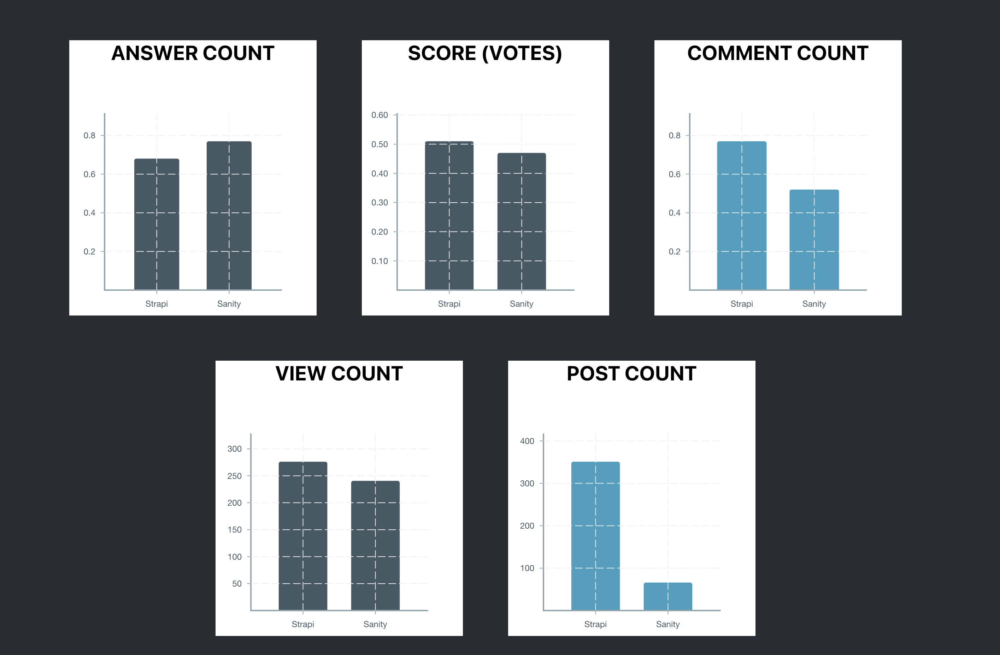

# MCIS Task

This task examines the behaviour of contributors in relation to specified tags 
on stackoverflow.

## Description
The task investigates two tags namely: Strapi and Sanity. 
The obtained posts under the 2 tags were taken within the specified period 
of January, 2021 and June, 2021 (a 6-month period).

## Metrics
Five notable metrics were selected alongside each post extracted. They include:
+ Answer Count 
+ Score (votes) 
+ Comments Count
+ View Count
+ Post Count


### Motivation 
The table below displays the five metrics and the reasons why they were selected.

| Metrics             | Motivation        |
| ----------------- | ------------------------------------------------------------------ |
| Answer Count | To know the number of answers the posts had. |
| Score|  To verify the quality of the post, whether users approve them or not. |
| Comment Count |  To determine how users engage with posts.|
| View Count |  To know the number of views a post has and compare with the answer count of posts. |
| Post Count |  To ultimately compare the popularity of a tag. |

## Tech Stack 

Languages: React JavaScript and SQL

Library: [Victory](https://formidable.com/open-source/victory/gallery) 


## Data Extraction

The data was derived from querying the StackExchange Data Explorer website. 
Two customized queries, representing the two tags, were composed and ran on [StackExchange URL](https://data.stackexchange.com/stackoverflow/query/new).
The [StackExchange URL](https://data.stackexchange.com/stackoverflow/query/new) provides a 
'Download CSV' button which was utilized to extract the data in a csv file.

Below are the two queries that were used:
+ #### Strapi Tag 
```sql
SELECT p.id, p.CreationDate, p.Tags, p.AnswerCount, p.Score, p.CommentCount, p.ViewCount   
FROM Posts p
WHERE
p.CreationDate between '2021-01-01' and '2021-07-01'
AND p.Tags like '%strapi%' 
ORDER BY p.CreationDate DESC

```

+ #### Sanity Tag
```sql
SELECT p.id, p.CreationDate, p.Tags, p.AnswerCount, p.Score, p.CommentCount, p.ViewCount   
FROM Posts p
WHERE
p.CreationDate between '2021-01-01' and '2021-07-01'
AND p.Tags like '%sanity%' 
ORDER BY p.CreationDate DESC

```

## Findings

The extracted data pertaining to the two tags yielded some interesting results. 
The first observation was the difference in the number of posts under each tag. 
Strapi had about 5 times the number of posts as compared to Sanity, which is illustrated in
the table below.
To understand the differences in distribution of the metrics between the tags, 
descriptive statistical analysis was used where the averages of the other metrics (i.e. 
Answer Count, Score, Comment Count and View
Count) were computed. Below are the figures of each metric.

| Metrics             | Strapi        | Sanity |
| ----------------- | ------------------- |  ------------------- |
| Answer Count (Avg) | 0.68  |  0.77    |
| Score (Avg)         | 0.51  |   0.47  |
| Comment Count (Avg) |  0.77 |   0.52  |
| View Count (Avg)  |  276.09  |  240.62    |
| Post Count        |   351 |    66  |


### Screenshot




## Conclusions
The findings show that Strapi is more popular than Sanity, based on its total number of 
posts. The higher number of posts under Strapi also corresponds 
with other metrics namely comments count, views count and scores (votes). However, 
even though Sanity has fewer posts as compared to Strapi, the average Sanity 
post has more answers. 


## FUTURE WORK

To improve and further examine this task, extra metrics such as AcceptedAnswer 
and its creation time should be looked at. This can be used in determining
how long it takes for posts to be answered.
